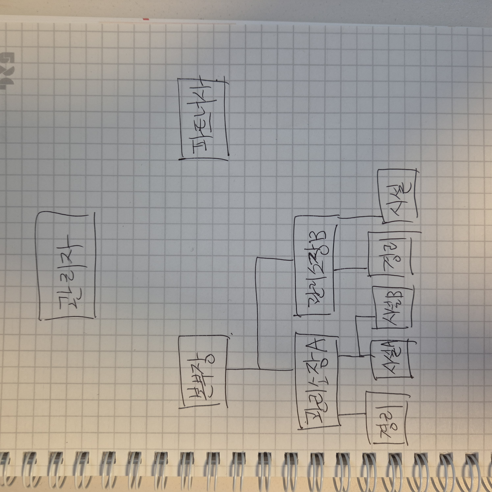

# 유저 유형 관계도 (Single Source of Truth)

본 문서는 관리의달인(Manager Master) 플랫폼의 6개 사용자 역할과 그 상하 관계를 정의한다.
모든 신규 기능은 이 관계도를 기준선으로 설계·구현한다.

> 원본 손그림(사용자 작성): [`user-role-diagram.jpg`](./user-role-diagram.jpg)



## 6개 역할

| 역할 키 | 표시명 | 포털 | 설명 |
| --- | --- | --- | --- |
| `platform_admin` | 관리자 | `hq` | 본사(플랫폼) 최상위. 전 건물 가시성. |
| `hq_executive` | 본부장 | `hq` | 자신에게 할당된 관할 건물 묶음에서만 권한 행사. |
| `manager` | 관리소장 | `building` | 자기 소속 건물의 모든 직원·데이터 책임자. |
| `accountant` | 경리 | `building` | 자기 소속 건물의 본인 데이터(회계/수납·연체) 한정. |
| `facility_staff` | 시설기사 | `building` | 자기 소속 건물의 본인 데이터(점검/시설) 한정. |
| `partner` | 파트너사 | `partner` | `vendor_id` 기반 ACL — 본사·단지 도메인 데이터에 접근하지 않는다. |

## 상하 관계

```
관리자(platform_admin)
└─ 본부장(hq_executive) — 관할 건물 N개 (다대다 매핑)
   └─ 관리소장(manager) — 건물 1개
      ├─ 경리(accountant)
      └─ 시설기사(facility_staff)

파트너사(partner) — 건물 도메인과 분리된 별도 엔티티
```

- **관리자(platform_admin)** 는 전 건물 수퍼유저다.
- **본부장(hq_executive)** 은 `hq_building_assignments` 매핑 테이블의 행을 통해
  관할 건물 묶음을 갖는다. 매핑이 비어 있는 본부장은 데이터를 보지 못한다(빈 결과 + 안내).
  매핑이 있는 본부장은 그 건물 안의 관리소장/경리/시설기사 데이터를 모두 본다.
- **관리소장(manager)** 은 자기 건물의 경리·시설기사 데이터를 모두 보고
  일보를 취합한다(`users.building_id` 단일 소속).
- **경리/시설기사** 는 자기 건물 안에서 본인 작성분만 보고/수정한다.
- **파트너사** 는 별도 포털이며 `vendor_id` 기반 ACL 로만 자기 회사 데이터에 접근한다.
  본사/관리소장/경리/시설기사 도메인 데이터에 어떤 경로로도 접근하지 않는다.

## 권한 경계 SoT 위치

- 역할 라벨: `lib/shared/src/role-labels.ts`
- 본부장 관할 매핑 스키마: `lib/db/src/schema/hqBuildingAssignments.ts`
- 본부장 관할 조회 헬퍼: `artifacts/api-server/src/middlewares/buildingScope.ts`
  (`getAccessibleBuildingIds`, `getHqAssignedBuildingIds`)
- 본부장 매핑 관리 API: `artifacts/api-server/src/routes/hqAssignments.ts`
  - `GET /api/hq/assigned-buildings` — 본부장 본인의 매핑 조회
  - `GET/POST/PUT/DELETE /api/admin/hq-assignments[...]` — `platform_admin` 전용 CRUD
- 본부장 매핑 관리 UI(관리자): `artifacts/manager-app/src/pages/platform-hq-assignments.tsx`
  (사이드바 진입: `${SHARED_ROLE_LABELS.hq_executive} 관할 건물`)
- 회원가입 역할 선택 화면: `artifacts/manager-app/src/pages/onboarding/role-select.tsx`
  (본부장도 자가 선택 가능. 단, 매핑 0건이면 데이터가 비어 있음.)
- 6개 역할 회귀 테스트: `artifacts/api-server/src/__tests__/six-roles-scope.test.ts`

## 본부장 가시성 게이트 흐름

1. 신규 사용자가 가입 후 역할 선택 화면에서 **본부장(HQ)** 을 고른다.
2. 백엔드는 `users.role='hq_executive'`, `portal_type='hq'`, `approval_status='active'`
   로 저장한다(시설기사처럼 `pending` 으로 두지 않는다).
3. `hq_building_assignments` 매핑이 0건인 동안에는 본부장의 모든 데이터 조회가
   빈 결과를 반환한다(`getAccessibleBuildingIds` 가 `{ unrestricted:false, ids:[] }`
   를 돌려주기 때문). 대시보드에는 **"아직 관할 건물이 할당되지 않았습니다"** 배너가 노출된다.
4. `platform_admin` 이 `/platform/hq-assignments` 화면에서 본부장에게 건물을 할당하면,
   해당 본부장은 곧바로 그 건물 묶음의 데이터를 조회할 수 있다.
5. 단순한 `approvalGateMiddleware` 의 통과/차단 대신 **데이터 스코프** 가 게이트로
   동작한다. 본부장은 게이트는 통과하지만 매핑이 없을 때는 어떤 건물의 데이터도
   누설하지 않는다는 안전 성질을 보장한다.

## 신규 기능 개발 규칙

> **모든 신규 기능은 본 관계도를 기준선으로 설계·구현한다.**
> 6개 역할 외 신규 역할 추가가 필요한 경우는 본 문서를 먼저 갱신한 뒤 코드를 추가한다.
